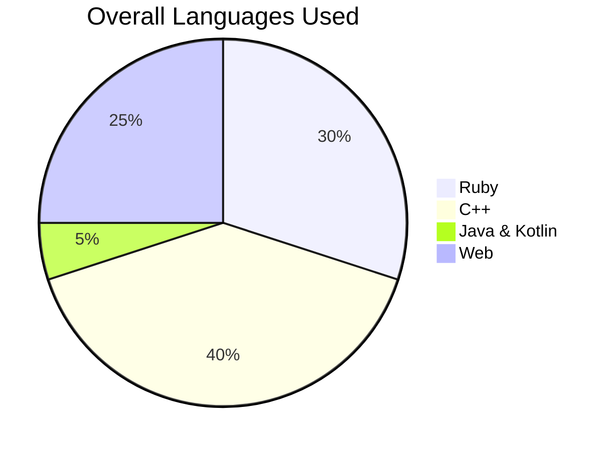

<picture>
  <source media="(prefers-color-scheme: dark)" srcset="https://www.dropbox.com/s/3tkccxf9g43r4ml/Forest-Matrices_2880_Lede.jpg?raw=1">
  <source media="(prefers-color-scheme: light)" srcset="https://www.dropbox.com/s/3tkccxf9g43r4ml/Forest-Matrices_2880_Lede.jpg?raw=1">
  
</picture>

## About Me

<!-- TO DO: add more details about me later -->
- 👋 Hi, I’m Ash
- 👀 I’m interested in learning new technology and widely used algorithms 
- 🌱 I’m currently learning TypeScript and Vue.js
- 💞️ I’m looking to collaborate on projects related to Ruby and web
- 📫 How to reach me : ab9168293@gmail.com

My top languages

| Rank |   Languages   |
|-----:|---------------|
|     1|       C++     |
|     2|       Ruby    |
|     3|       JS      |
|     4|       HTML    |

---
> If we pull together and commit ourselves, then we can push through anything.

— Mona the Octocat

